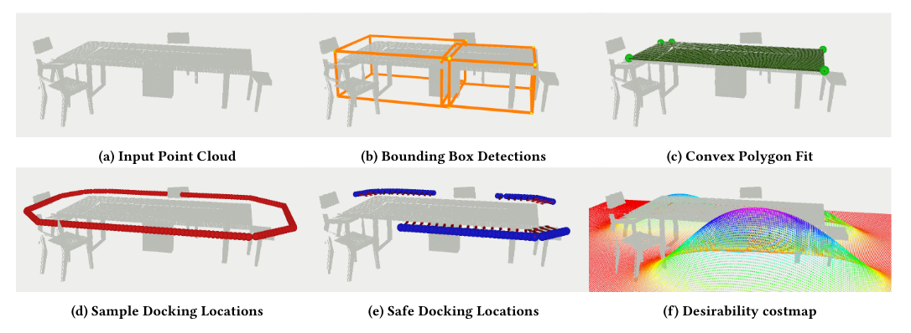

# ApproachFinder-CV
A real-time computer vision algorithm to find potential docking locations indoor environments.


## Introduction
TODO: Project Brief / Abstract

## Installation Instructions

**Installation Prerequisites**
1. Install [Ubuntu 18.04 64-bit](https://ubuntu.com/)
2. Install [ros-melodic-desktop-full](http://wiki.ros.org/melodic/Installation/Ubuntu)

This repository is divided into 3 standalone ROS packages:
- **simulation**: provides a robot and simulation environments for real-time testing for the vision pipeline.
- **votenet**: contains ROSified version of votenet trained to detect tables and toilet in indoor environments. 
- **docking_locations**: consist our computer vision pipeline to find docking locations and generates desirability cost-maps. 

Each of the above-mentioned folders contains a README which summarises exact steps to install module specific packages. Please refer each README file for further installation instructions and demo instructions.

## Demo in Simulation
You can run the demo by following these 3 steps:
1. Simulation Environment
   1. Launch the simulation environment in Gazebo:
      ```asm
       roslaunch my_worlds my_office_env.launch
      ```
   2. Spawn the robot at specified location:
      ```asm
        roslaunch my_robot spawn.launch x:=4 y:=4
      ```
   3. Publish pointcloud to votenet:
      ```asm
        rosrun my_robot time_sync_subscriber_node
      ```
   4. Launch RVIZ to visualise the results
      ```asm
        roslaunch my_robot rviz.launch rvizconfig:=demo.rviz
      ```
   5. Joytick Controller to drive the robot
      ```asm
        roslaunch teleop_twist_joy teleop.launch
      ```
2. Launch Votenet
   1. Launch votenet to detect tables and toilets:
      ```asm
        rosrun ros_votenet ros_votenet_detection.py 
      ```
3. Launch CV pipeline
   1. Launch docking locations node:
      ```asm
        rosrun desirable_locations find_locations_approx_node 
      ```
   2. Launch costmap node:
      ```asm
        rosrun desirable_locations cost_map_heading.py
      ```

For further details please refer each sub-directory.

## Simulation Results:


## How to run ApproachFinder-CV on your data?
1. Publish the point cloud on topic *"/camera/depth/points"*. This should be in up-right position (z-axis up).
2. Publish depth image on topic *"/camera/depth/image_raw"*. This channel expects the depth values in meters.
3. Publish the camera information on topic *"/camera/depth/camera_info"*. Please refer here to know more about [CameraInfo](https://docs.ros.org/en/melodic/api/sensor_msgs/html/msg/CameraInfo.html) message.

### Results on [SUN RGB-D](https://rgbd.cs.princeton.edu/) dataset:


