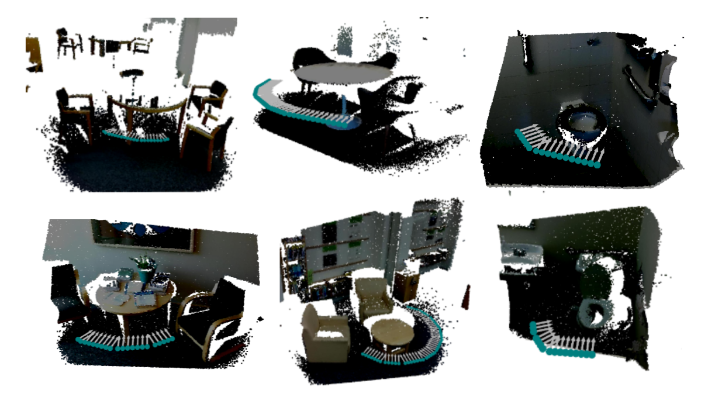

# ApproachFinder-CV
A real-time computer vision algorithm to find potential docking locations indoor environments.


## Introduction
TODO: Project Brief / Abstract

## Installation Instructions

**Installation Prerequisites**
1. Install [Ubuntu 18.04 64-bit](https://ubuntu.com/)
2. Install [ros-melodic-desktop-full](http://wiki.ros.org/melodic/Installation/Ubuntu)

This repository is divided into 3 standalone ROS packages: simulation, votenet and docking locations.
- simulation: provides a robot and simulation environments for real-time testing for the vision pipeline.
- votenet: contains ROSified version of votenet trained to detect tables and toilet in indoor environments. 
- docking_locations: consist our computer vision pipeline to find docking locations and generates desirability cost-maps. 

Each of the above-mentioned folders contains a README which summarises exact steps to install module specific packages. Please refer each README file for further installation instructions.

## Demo in Simulation
1. Launch Simulation Environment
   1. Launch the simulation environment:
      ```asm
       roslaunch my_worlds my_office_env.launch
      ```
   2. Spawn the robot:
      ```asm
        roslaunch my_robot spawn.launch x:=4 y:=4
      ```
   3. Publish pointcloud to votenet:
      ```asm
        rosrun my_robot time_sync_subscriber_node
      ```
   4. Launch RVIZ to visualise th results
      ```asm
        roslaunch my_robot rviz.launch 
      ```
   5. Launch the joystick controller
      ```asm
        roslaunch teleop_twist_joy teleop.launch
      ```
2. Launch Votenet
   1. Launch votenet:
      ```asm
        rosrun ros_votenet ros_votenet_detection.py 
      ```
3. Launch CV pipeline
   1. Launch docking locations node:
      ```asm
        rosrun desirable_locations find_locations_approx_node 
      ```
   2. Launch costmap node:
      ```asm
        rosrun desirable_locations cost_map_heading.py
      ```

For further details please refer each sub-directory.

## Results


