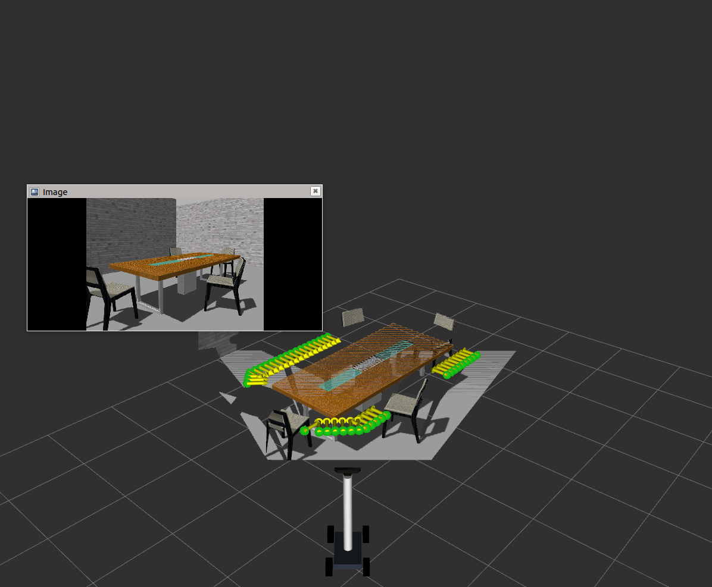

## Docking Locations and Temporal Desirability

Run the ros-node to find docking locations aound indoor objects in a scene:
```bash
rosrun desirable_locations find_locations_approx_node 
```

### Temporal Desirability: 
Temporal desiability is a 3D costmap which has X,Y and heading. We can visualise XY grid maps corresponding to each binned heading. 
For this, first launch the cost_map node and then configure the RVIZ configurations.

Run the code to find the cost map for the docking locations by:
```bash
rosrun desirable_locations cost_map_heading.py
```

Finally, open the configuration file under *'simulation/src/my_robot/config'* with rviz through GUI or by running this command:
```asm
roslaunch my_robot rviz.launch rvizconfig:=my_robot_new.rviz
```

## Results:





