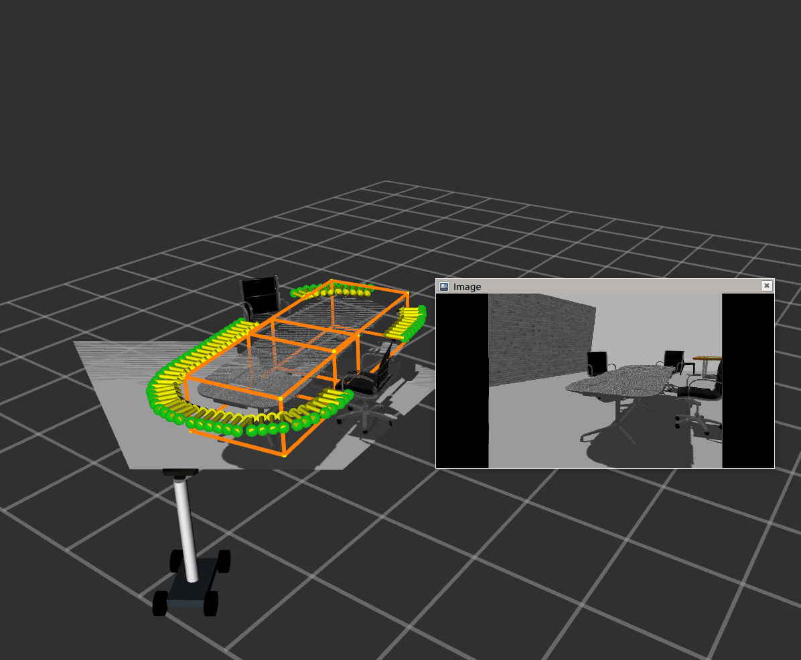
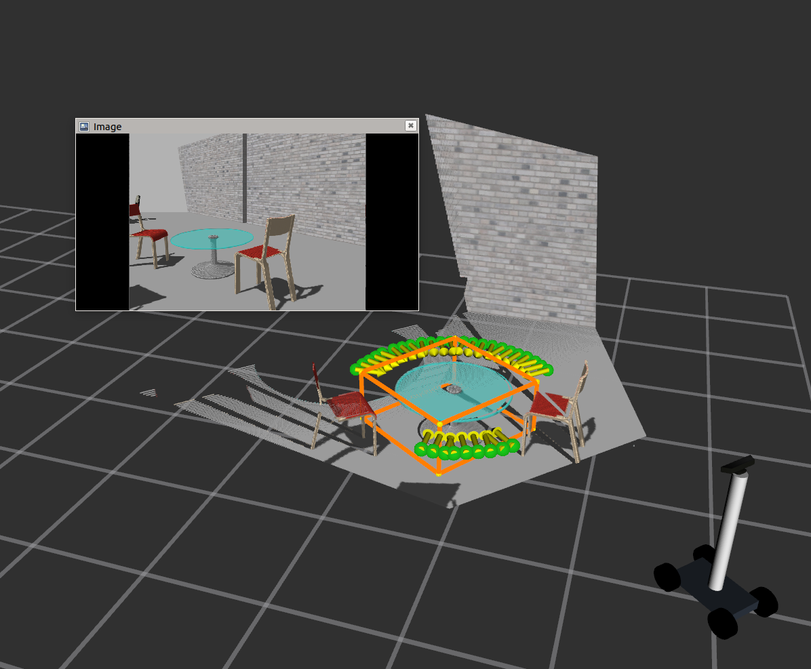
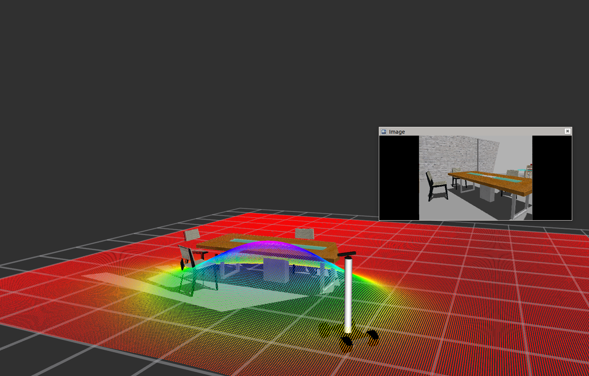
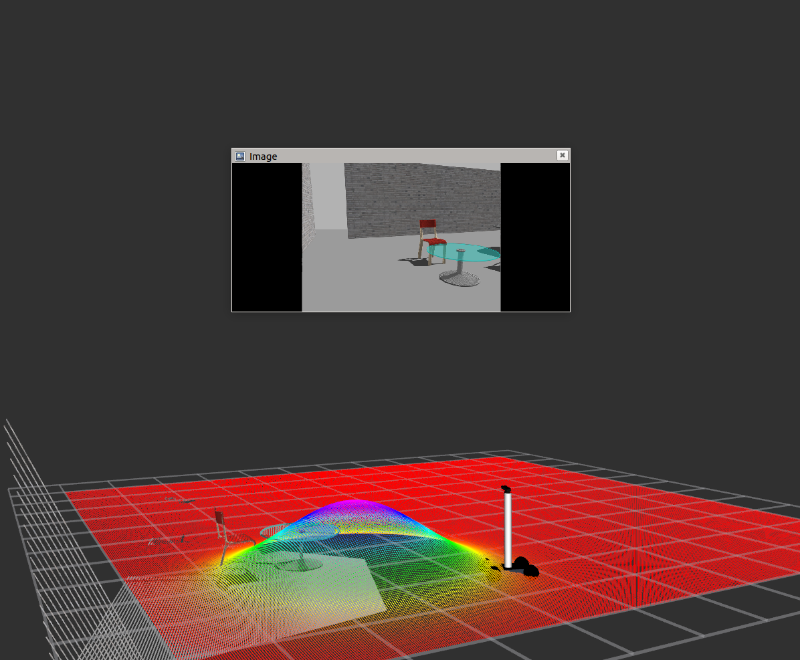

## Docking Locations and Temporal Desirability

### Installation Instructions:
- Install [PCL 1.8](https://pointclouds.org/downloads/)
- Install [Eigen3](https://ubuntu.pkgs.org/18.04/ubuntu-universe-amd64/libeigen3-dev_3.3.4-4_all.deb.html) 
- Install [OpenCV](https://docs.opencv.org/3.4.15/d7/d9f/tutorial_linux_install.html)
- Install [Open3D](http://www.open3d.org/docs/release/getting_started.html)

You might need some additional ROS packages:
```asm
sudo apt-get install ros-melodic-rviz-visual-tools 
```
### Steps to find docking locations in simulation:
**Run the simulation setup:**
```asm
cd simulation
roslaunch my_worlds my_office_env.launch
roslaunch my_robot spawn.launch x:=4 y:=4
roslaunch my_robot rviz.launch rvizconfig:=demo.rviz
roslaunch teleop_twist_joy teleop.launch
rosrun my_robot time_sync_subscriber_node
cd ../votenet
rosrun ros_votenet ros_votenet_detection.py
```
**Run the ros-node to find docking locations aound indoor objects in a scene:**
```asm
cd ../docking_locations
rosrun desirable_locations find_locations_approx_node 
```

### Temporal Desirability: 
Temporal desiability is a 3D costmap which has X,Y and heading. We can visualise XY grid maps corresponding to each binned heading. 
For this, first launch the cost_map node and then configure the RVIZ configurations.

**Run the code to find the cost map for the docking locations by:**
```asm
rosrun desirable_locations cost_map_heading.py
```


## Results:

 
 
