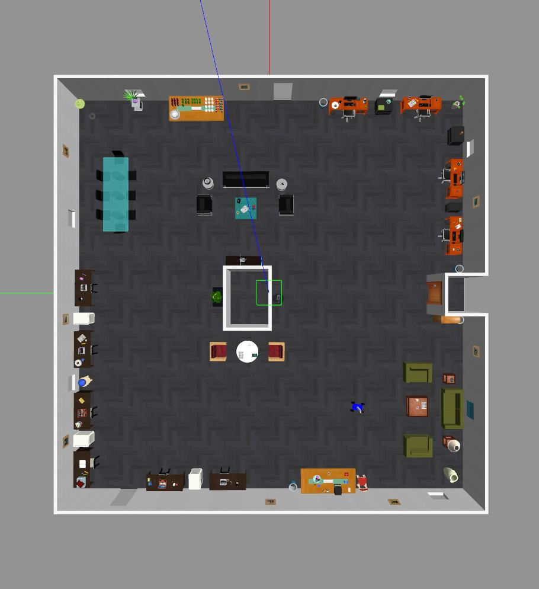
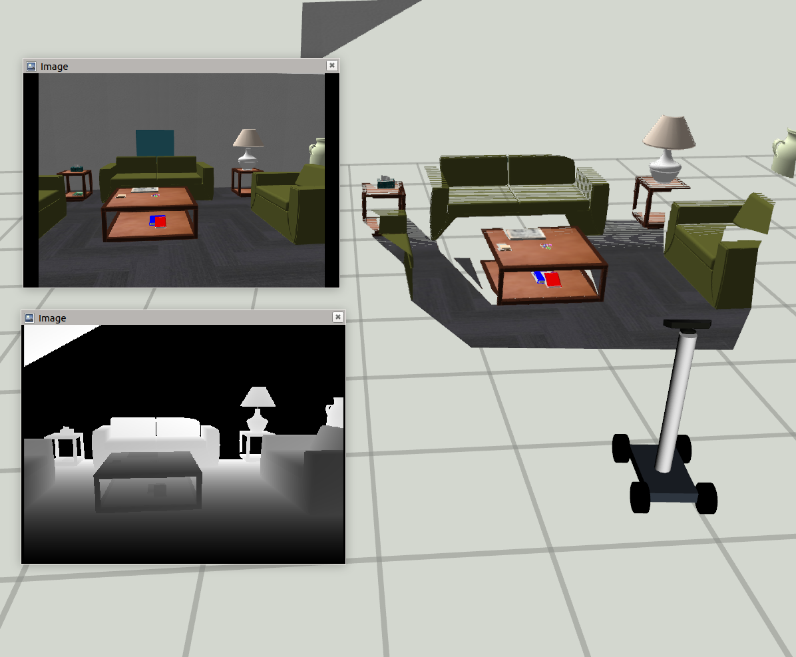

## Simulation Environment in Gazebo
### Installation Instructions:

- Download gazebo models from [here](https://data.nvision2.eecs.yorku.ca/3DGEMS/) and save it under *my_worlds/models* directory.
- Install [Gazebo9.x](http://gazebosim.org/tutorials?cat=install&tut=install_ubuntu&ver=9.0)
- Install [PCL 1.8](https://pointclouds.org/downloads/)

Compile the code by running catkin_make from *'simulation'* folder and source the files.
```asm
cd ../simulation
catkin_make  
source devel/setup.bash
```


### Steps to launch the simluation environment:

**Launch any world environment from 'my_worlds/launch' folder by:**
```
roslaunch my_worlds <file_name>.launch
eg. roslaunch my_worlds  office_env_large.launch
```
**Spawn the robot in the gazebo environment by supplying XY locations:**
```asm 
roslaunch my_robot spawn.launch x:=5 y:=5
```
**Launch the robot model in RVIZ with specified RVIZ configuration file:**
```asm
roslaunch my_robot rviz.launch rvizconfig:=simple_viz.rviz
```

If everything works fine then you should see robot model, point cloud and images of the scene.

**Robot Control: keyboard or joystick**

```asm
 rosrun my_robot teleop_twist_keyboard.py
 OR
 roslaunch teleop_twist_joy teleop.launch
```

## Results:


