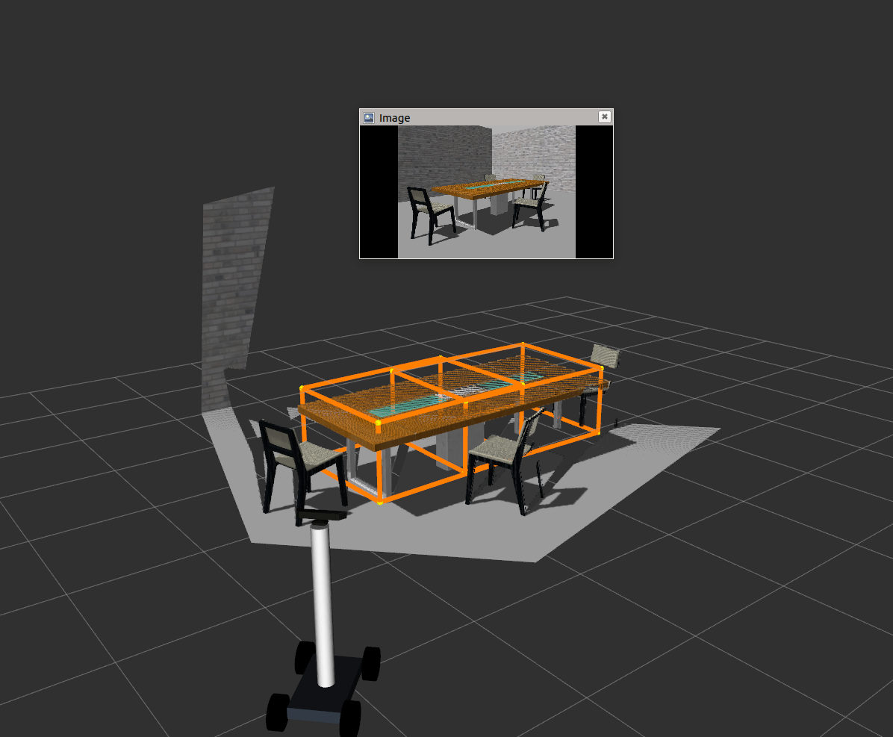

## Votenet ROS integration
Please follow the instructions given [here](https://github.com/facebookresearch/votenet) to install votenet relevant packages. 

Note: If you wish to use conda multiple environments and CUDA versions, then source them properly.

We ship the code with a model trained on tables and toilets under *'ros_votenet/scripts/votenet_model'*. 

Run the rosified Votenet for table and toilet detections by: 
```
rosrun ros_votenet ros_votenet_detection.py 
```

Finally, send time-sychrnoised point cloud to votenet by running:
```
rosrun my_robot time_sync_subscriber_node
```

Subscribe to "/votenet/bboxRviz" topic in RVIZ for bounding box visualisations.

### Results:




