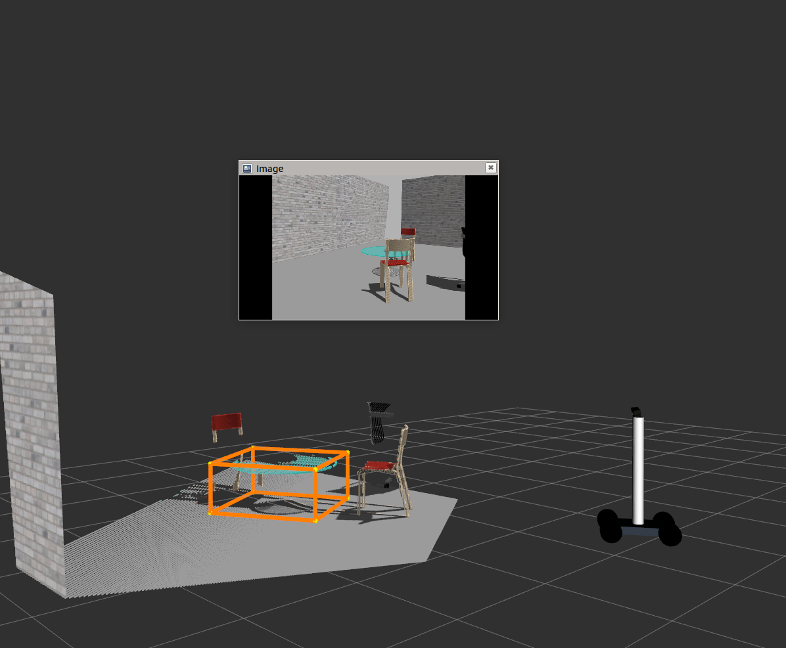
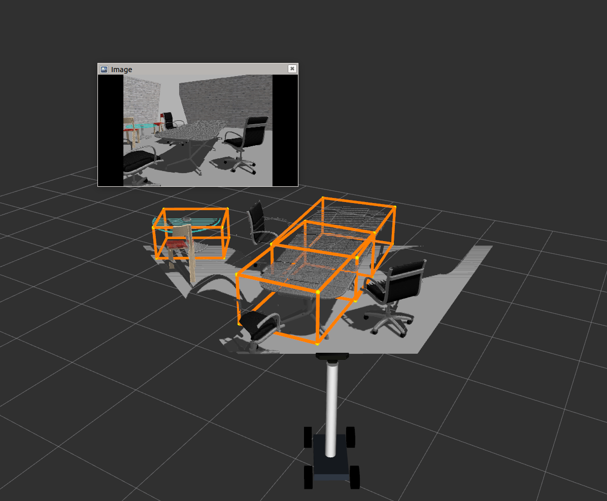

## Votenet ROS integration
### Installation Instructions:

Please follow the instructions given [here](https://github.com/facebookresearch/votenet) to install relevant votenet packages. 

Note: It suggested that you install packages with [Anancoda](https://www.anaconda.com/products/individual) for seamless integration. 

### Steps to run Votenet in simulation
We ship a trained votenet model to detect tables and toilets in indoor environments. It's placed under *'ros_votenet/scripts/votenet_model'*. 

**Run the rosified votenet for table and toilet detections by:** 

```asm
rosrun ros_votenet ros_votenet_detection.py 
```

**Finally, send time-sychronised point cloud to votenet by running:**
```asm
rosrun my_robot time_sync_subscriber_node
```

Subscribe to "/votenet/bboxRviz" topic in RVIZ for bounding box visualisations.

### Results:

 
